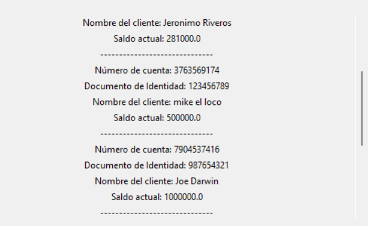
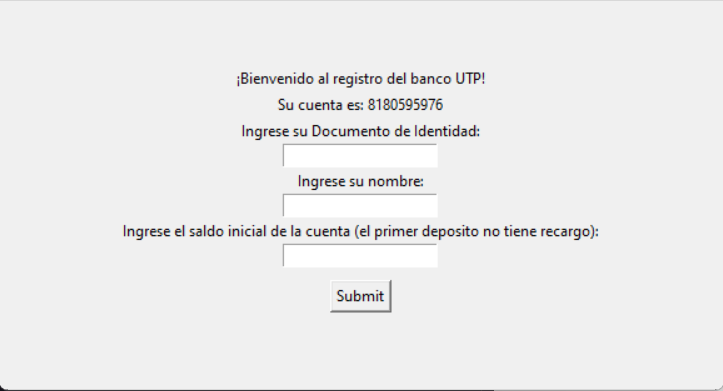
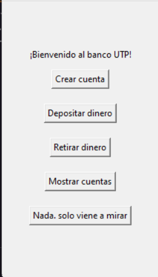

# Bank MVC
## Description
Para este ejercicio se establecieron unos *Requerimientos*
#### Requerimientos de la Arquitectura
- La aplicación debe tener dos Componentes (Modelo, UI) y que serán invocados desde un
main

- Constructor por defecto Número de cuenta, Documento de Identidad, Nombre, Saldo.
- Contar con un método que permita depositar y retirar Dinero.
- Almacenar en un lista (cuentaClientes) todas las cuentas creadas.
- Crear el diagrama de Clase pertinente (Consultar en los libros de la bibliografía)
- Crear el diagrama Componentes pertinente (Consultar en los libros de la bibliografía)

#### Adicional
- He añadido un archivo que se encargará de guardar el registro de las cuentas en una lista. Además, este archivo llenará la lista con la información contenida en el archivo bankdata.txt.

## Instrucciones de Uso
- Para ejecutar el programa se recomienda crear un entorno virtual de python, sin embargo no es necesario:
```bash
python -m venv venv
```
- Luego, activar el entorno virtual:
```bash
source venv/bin/activate
```
- Este proyecto no cuenta con requerimientos adicionales, por lo que no es necesario instalar librerías adicionales.

- Para ejecutar el programa, se debe correr el archivo main.py:
```bash
python main.py
```

## Detalles de Implementacion
- **Clase Cuenta:** Se encarga de crear una cuenta con los atributos: Número de cuenta, Documento de Identidad, Nombre, Saldo. Además, cuenta con los métodos: depositar y retirar dinero.
<!-- añadir una imagen  -->


- **Clase Db:** Se encarga de guardar el registro de las cuentas en una lista. Además, este archivo llenará la lista con la información contenida en el archivo bankdata.txt.


- **Componentes:** 
  - *Modelo:*  Se encarga de crear la clase Cuenta y la clase Db
  - *Utils:*  Se encarga de la logica del programa


- **Interfaz:** Se encarga de mostrar el menú de opciones al usuario y de recibir la información necesaria para crear una cuenta
    <div>
    
    
    </div>
       


### Contribuir
Para contribuir a este proyecto, por favor contactar al propietario del repositorio o hacer un pull request.

### Licencia
Este proyecto cuenta con la licencia MIT. Para más información, por favor revisar el archivo [LICENSE.md](LICENSE.md)

### Autor
Jeronimo Riveros


